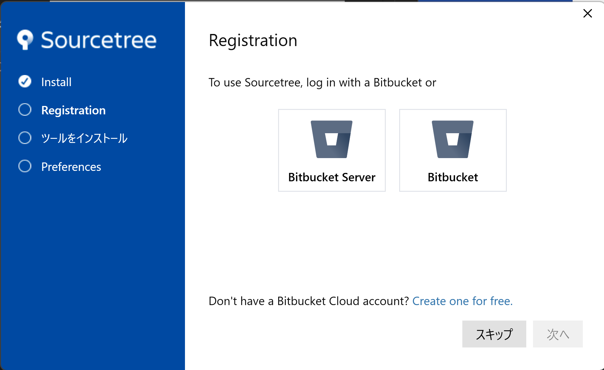
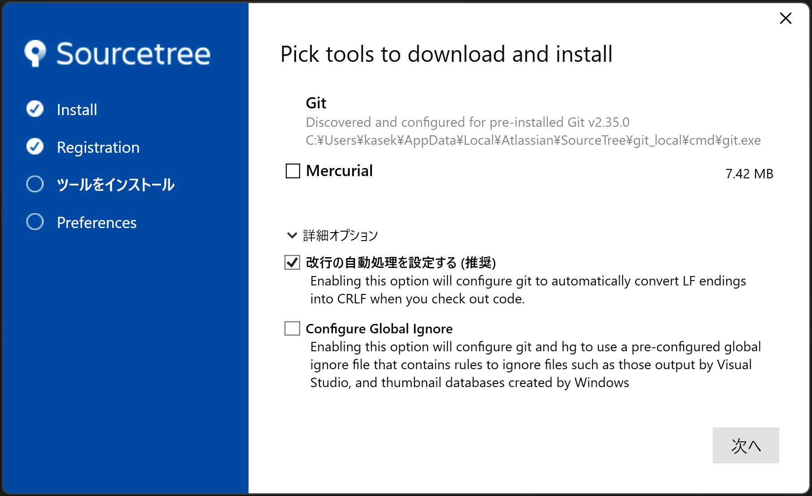
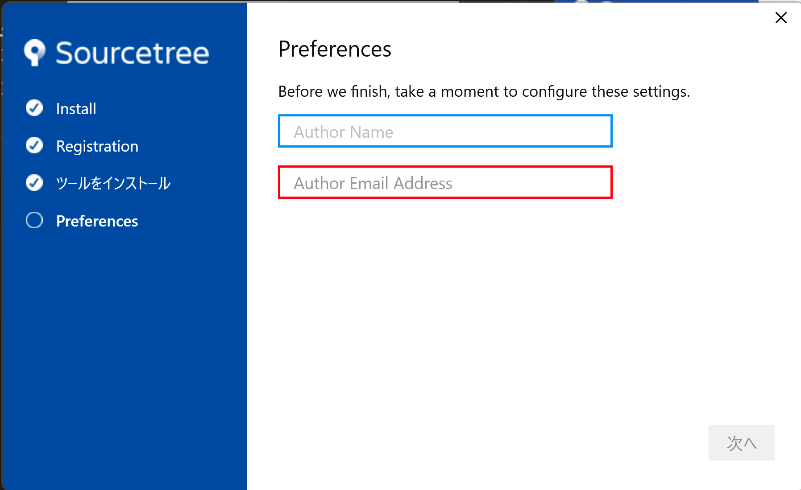
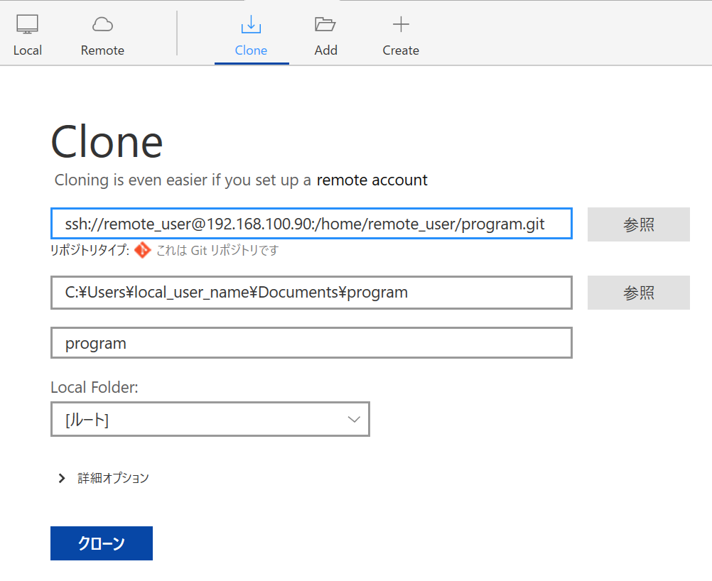
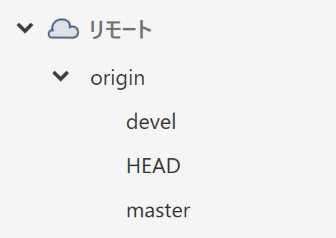
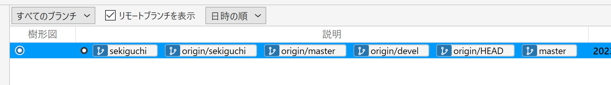
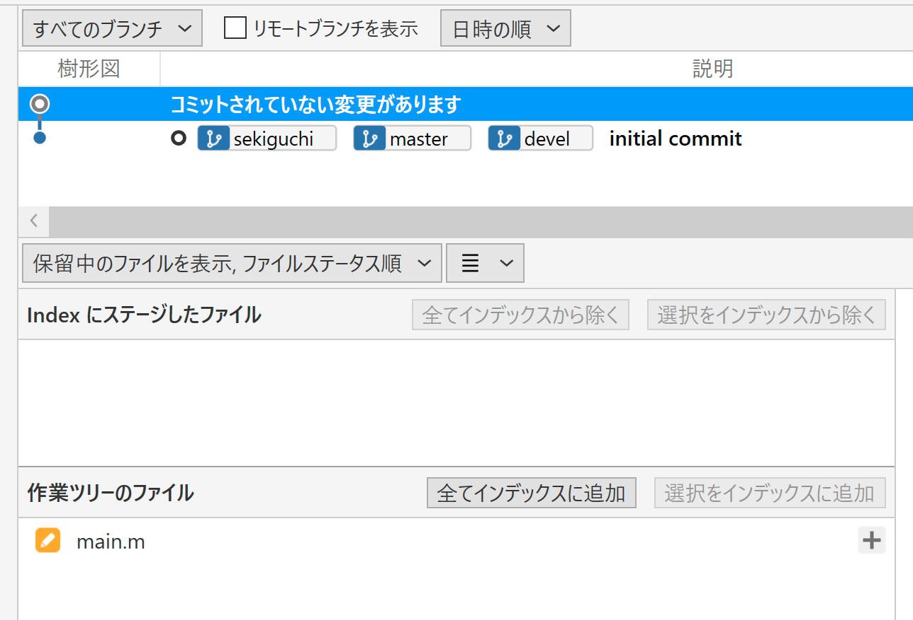

# git 開始方法

## インストール

[git](https://git-scm.com/download/win)をインストール
[sourcetree](https://www.atlassian.com/ja/software/sourcetree) をインストール
「スキップ」
写真のように設定し「次へ」
指示通り設定

## アプリ設定

用語：本セクション中の
|  用語  |  意味  |
| ---- | ---- |
|  remote_user  |  リポジトリサーバ上のユーザー名<br>関口から指定されるユーザー名に置き換える |
|  local_user  |  お使いのPC上のユーザー名。<br>この記事と異なっていても特に意識しなくてOKな部分  |

### SSHキー作成

インストール後
「ツール」＝＞「SSHキーの作成/インポート」＝＞「Generate」
マウスカーソルを適当に動かすとキーができる．

「Save private key」でprivatekey.ppkというファイル名で保存
「Save publick key」で自分の名前+".pub"（私の場合sekiguchi.pub）をファイル名にして保存．

「ツール」＝＞「オプション」＝＞「全般」＝＞「SSHクライアントの設定」＝＞「SSHキー」
に上で作ったprivatekey.ppk を登録

上で作った.pubファイルを関口に送り，サーバーに登録してもらう．

### ppk登録

publick key 登録後，研究室LAN内でコマンドプロンプトで以下を実行

```
> cd path_to_ppk
> "%UserProfile%\AppData\Local\SourceTree\app-3.4.14\tools\putty\plink.exe" -ssh -C -i "privatekey.ppk" remote_user@192.168.100.90
```

「path_to_ppk」は上でppkファイルを保存したフォルダへのパス
「app-3.4.14」の部分はインストールしたsourcetree のバージョン
二行目のコマンドは長くPDFでは見切れてしまうので以下に同じものを掲載する。１行のコマンドとして実行する必要がある。
"%UserProfile%\AppData\Local\SourceTree\app-3.4.14\tools\putty\plink.exe" -ssh -C -i "privatekey.ppk" remote_user@192.168.100.90

実行時にy/n と聞かれるのでy と入力しenter

```
remote_user@phoebe:~$
```

と表示されたら成功．表示されなければ関口に相談する．

### リモートリポジトリのクローン

sourcetreeの 「Clone」で以下を設定し「クローン」を押す


クローンするフォルダ名はわかりやすいように変更してもOK
例：Documents\program　＝＞　Documents\collab

「クローン」ボタンが押せない場合はppkの設定がちゃんとできているか確認する。
注意：SSHキーに設定するppkとpubはペアなので、SSHキーをGenerateし直した場合、pubキーを登録しなおす（関口送りなおす）必要がある。

### devel ブランチへ切り替え

写真のように開き，develをダブルクリックしてdevelブランチに切り替える．


### 個人開発用ブランチ作成

次に「ブランチ」を押し，新規ブランチに自分の名前（私の場合sekiguchi）を設定し「ブランチを作成」

「プッシュ」を押し，今作ったブランチを対象にセットし「プッシュ」

「リモートブランチを表示」のチェックを入れ，写真のようにorigin/名前（私の場合 origin/sekiguchi）が見えていればOK

以上で開発のための準備が完了

## 運用ルール

各ブランチの運用ルールは以下の通り

個人名ブランチは変更の塊ごとにcommitし，毎日pushする．

devel はエラー無く回る状態のものを週１程度を目処に個人名ブランチからmergeする．
１週以上エラーが取れないときは相談すること。

master は大きな区切り（学会発表や公聴会など）毎にdevelからmergeする．

## 使い方

ファイルを変更すると写真のように作業ツリーのファイルに変更したファイルが表示される．


1. 「全てインデックスに追加」を押すとIndexにステージしたファイルに移動する．
2. この状態で「コミット」を押すとコミットのためのコメント記入欄が出てくるので，どんな変更をしたのかメモを残し「コミット」ボタンを押す．
3. 「プッシュ」でサーバーに変更を登録

# 関口用備忘録

config/manual 参照

```
ssh-keygen -i -f id_rsa.conan >> authorized_keys
```

とすることでputty形式のキーを追加できる。

リポジトリを設定するときは

```
> mkdir program
> git init --bare
```

ユーザー登録

```
sudo adduser usern
```

パスワード生成はmanualフォルダ参照

ユーザー削除

```
sudo userdel -r usern
```
